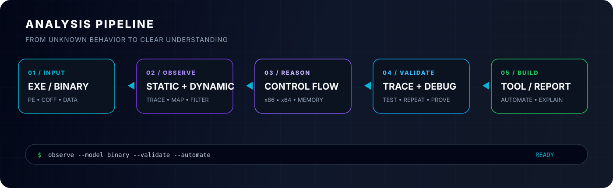
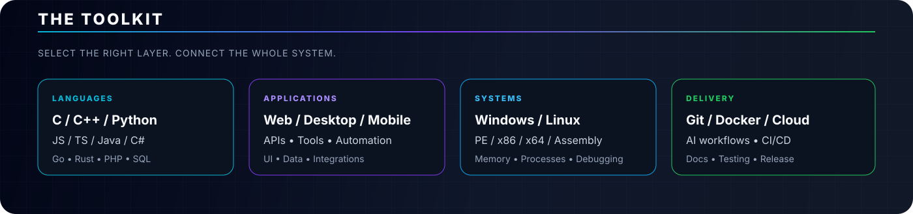
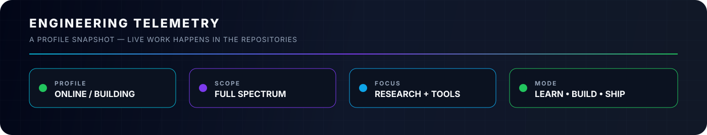

  

  

    <a href="https://github.com/mahdi2372"><code>PROFILE / ONLINE</code></a>
    <a href="https://github.com/mahdi2372?tab=followers"><code>FOLLOW / CONNECT</code></a>
    <a href="https://github.com/mahdi2372?tab=repositories"><code>SCOPE / FULL SPECTRUM</code></a>
    <a href="https://github.com/mahdi2372"><code>MODE / AI ASSISTED</code></a>
  

  <a href="#about">About</a> •
  <a href="#the-universe">The Universe</a> •
  <a href="#toolkit">Toolkit</a> •
  <a href="#method">Method</a> •
  <a href="#telemetry">Telemetry</a>

# Full-Spectrum Developer • Reverse Engineer • AI Builder

## About

I’m **Mahdi** — a full-spectrum developer working across software, systems, AI, automation, and security-minded engineering.

From low-level executable and binary analysis to high-level web platforms, desktop applications, developer tools, and AI-assisted workflows, I learn the system, understand the problem, and build the right solution for it. I do not limit myself to one language, one framework, or one layer of the stack.

> **One mindset. Every layer. Better systems.**

## The Universe

<table>
  <tr>
    <td width="33%" valign="top">
      <h3>🔬 Reverse Engineering</h3>
      Windows executables, PE/COFF, x86/x64, assembly, static and dynamic analysis, debugging, disassembly, decompilation, and behavior tracing.
    </td>
    <td width="33%" valign="top">
      <h3>🧠 AI & Automation</h3>
      AI-assisted development, code comprehension, pattern discovery, research workflows, intelligent automation, and rapid prototyping.
    </td>
    <td width="33%" valign="top">
      <h3>🌐 Web & Backend</h3>
      Interfaces, full-stack applications, APIs, real-time systems, authentication, integrations, dashboards, and scalable services.
    </td>
  </tr>
  <tr>
    <td width="33%" valign="top">
      <h3>🖥️ Desktop & Mobile</h3>
      Desktop applications, system utilities, cross-platform tools, productivity software, and mobile-ready experiences.
    </td>
    <td width="33%" valign="top">
      <h3>☁️ Systems & Cloud</h3>
      Linux, Windows, networking concepts, containers, cloud deployment, infrastructure, automation, and reliable delivery workflows.
    </td>
    <td width="33%" valign="top">
      <h3>🛡️ Security & Tooling</h3>
      Defensive utilities, privacy-aware software, secure-by-default design, authorized research, developer tools, and technical documentation.
    </td>
  </tr>
</table>

  

## Capability map

| Field | What I work across |
| --- | --- |
| **Languages** | C, C++, Python, JavaScript, TypeScript, Java, C#, Go, Rust, PHP, Ruby, Kotlin, Swift, Dart, SQL, Bash |
| **Applications** | Web apps, APIs, desktop software, cross-platform tools, automation, integrations, local utilities |
| **Systems** | Windows, Linux, executable formats, processes, memory concepts, debugging, containers, deployment |
| **Intelligence** | AI-assisted coding, LLM workflows, code analysis, research automation, pattern discovery |
| **Security** | Reverse engineering, binary analysis, defensive tooling, privacy, secure engineering, authorized testing |
| **Delivery** | Git, GitHub, documentation, reproducible workflows, testing, performance, maintainability |

## Toolkit

  

`PE / COFF` · `x86 / x64` · `Assembly` · `Ghidra` · `IDA Pro` · `x64dbg` · `WinDbg` · `Frida` · `AI / LLM workflows`

A representative toolkit, not a limitation. The right technology depends on the problem, constraints, users, and desired outcome.

## Method

  <table>
    <tr>
      <td align="center"><strong>01</strong> UNDERSTAND Map the problem</td>
      <td align="center">→</td>
      <td align="center"><strong>02</strong> DESIGN Choose the right layer</td>
      <td align="center">→</td>
      <td align="center"><strong>03</strong> BUILD Make it reliable</td>
      <td align="center">→</td>
      <td align="center"><strong>04</strong> EVOLVE Measure and improve</td>
    </tr>
  </table>

### Engineering principles

- **Evidence over assumptions** — understand behavior before drawing conclusions.
- **The right tool for the job** — choose technology by requirements, not trend.
- **Automation over repetition** — turn recurring work into reliable systems.
- **Clarity over noise** — explain complexity so others can build on it.
- **Security by default** — minimize risk, privilege, exposure, and unnecessary complexity.

## Research standard

Reverse engineering and security work should be responsible. My security-related work is intended for **owned software, learning, defense, privacy, and explicitly authorized testing only**. I value responsible disclosure, least privilege, secure defaults, and research that improves understanding without enabling harm.

## Telemetry

  

For live repositories, commits, languages, and contribution history, visit the profile and repository tabs above.

## Collaboration

I’m interested in ambitious work across reverse engineering, AI-assisted tooling, web platforms, desktop applications, systems, automation, and security-focused software. For a project idea, technical discussion, or collaboration, connect with me through GitHub.

  <a href="https://github.com/mahdi2372"><code>OPEN GITHUB PROFILE</code></a>
  &nbsp;&nbsp;
  <a href="https://github.com/mahdi2372?tab=repositories"><code>VIEW PROJECTS</code></a>

 

  <code>STATUS: EXPLORING • BUILDING • EVOLVING</code>
    
  <i>Every layer is a new language. Every problem is a new system. ✨</i>

 

  

